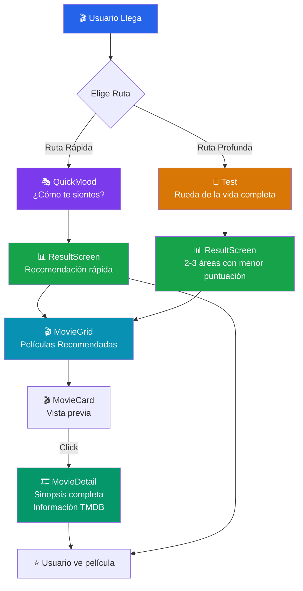

# Arquitectura - MindCinema

## 1. Visión General del Sistema

MindCinema es una aplicación web que actúa como guía inteligente de películas. Su propósito es ayudarte a encontrar películas con sentido según dos patrones de uso:

- **Entrada rápida**: necesitas una película ahora, cuéntame cómo te sientes
- **Entrada profunda**: quiero explorar cómo estoy en mi rueda de la vida

El sistema es un **frontend puro** sin autenticación ni persistencia. Los datos se resuelven en cliente con curaduría propia y enriquecimiento de TMDB, organizados en torno a 9 áreas de vida.

### Principios de Diseño

1. **Simplicidad**: Una entrada clara, dos caminos posibles
2. **Velocidad**: Desde pantalla inicial a recomendación en 3 clics máximo (ruta rápida)
3. **Significado**: Cada película está vinculada a un área de reflexión real
4. **Sin dependencias de backend**: Todo funciona con TMDB API + frontend

---

## 2. Diagrama de Flujo del Sistema



---

## 3. Arquitectura de Componentes

### Estructura General

```
App
├── Hero
├── Router/Navigation
│   ├── QuickPath
│   │   ├── QuickMood
│   │   ├── ResultScreen
│   │   └── MovieGrid
│   └── DeepPath
│       ├── Test
│       ├── ResultScreen
│       └── MovieGrid
├── MovieGrid
│   ├── MovieCard (x N)
│   │   └── MovieDetail (modal/página)
└── Footer
```

---

## 4. Descripción Detallada de Componentes

### 4.1 Hero
**Propósito**: Pantalla de bienvenida y selección de ruta  
**Props**: Ninguno  
**Estado Local**: Ninguno  
**Responsabilidades**:
- Mostrar el claim y frase hero de MindCinema
- Presentar dos botones: "Ruta Rápida" y "Exploración Profunda"
- Navegar a `/quick` o `/deep`

**Flujo Visual**:
```
┌─────────────────────────────┐
│     MindCinema              │
│   Cine para crecer          │
│                             │
│ Para las noches en que...   │
│                             │
│ [ Ruta Rápida ] [Profunda ] │
└─────────────────────────────┘
```

---

### 4.2 QuickMood
**Propósito**: Capturar el estado emocional del usuario para recomendación rápida  
**Props**: `onMoodSelect(mood: string)`  
**Estado Local**: `selectedMood`  
**Responsabilidades**:
- Mostrar estados emocionales o intenciones para entrada rápida
- Capturar selección del usuario
- Pasar el contexto al resultado

**Lógica**:
- Usuario selecciona un mood, estado emocional o intención
- Se genera una recomendación rápida
- Se navega a ResultScreen y después a MovieGrid

---

### 4.3 Test
**Propósito**: Evaluación de reflexión de la rueda de la vida completa  
**Props**: Ninguna  
**Estado Local**: 
```javascript
{
  currentAreaIndex: number,
  answers: { [area]: [response, response, response, response] },
  isComplete: boolean
}
```
**Responsabilidades**:
- Mostrar 4 preguntas por cada una de las 9 áreas
- Capturar respuestas (Sí = 1, A veces = 0.5, No = 0)
- Calcular puntuación por área
- Pasar a ResultScreen las 2-3 áreas con menor puntuación como base de recomendación

**Formato de Respuesta**:
```
Sí    = 1 punto
A veces = 0.5 puntos
No   = 0 puntos
```

---

### 4.4 ResultScreen
**Propósito**: Mostrar el resultado principal antes de pasar a la exploración de películas  
**Props**: `mode: "quick" | "deep", results?: { [area]: { score: number, percentage: number } }`  
**Estado Local**: Ninguno  
**Responsabilidades**:
- En modo `quick`, mostrar una recomendación rápida según el mood o intención elegida
- En modo `deep`, mostrar puntuación por área y síntesis del test
- Actuar como paso de transición hacia la exploración de películas
- Navegar a MovieGrid con la recomendación ya resuelta

**Visualización**:
```
Personal:     ████░░░░░░ 40%
Salud:        ██████░░░░ 60%
Propósito:    ███████░░░ 70%
...
```

---

### 4.5 MovieGrid
**Propósito**: Mostrar la lista navegable de películas recomendadas  
**Props**: `filterArea?: string | string[]`  
**Estado Local**:
```javascript
{
  movies: Movie[],
  loading: boolean,
  error: string | null
}
```
**Responsabilidades**:
- Resolver recomendaciones desde datos curados y enriquecerlas con TMDB
- Normalizar respuesta de TMDB
- Mostrar películas en grid cuando el usuario entra a explorar resultados
- Navegar a MovieDetail al hacer clic

**Lógica de Filtrado**:
- Si viene de QuickMood: mostrar películas ligadas al mood o intención ya resuelta en ResultScreen
- Si viene de Test: mostrar películas relevantes a las 2-3 áreas con menor puntuación

---

### 4.6 MovieCard
**Propósito**: Tarjeta individual de película  
**Props**: `movie: Movie, onSelect: (movie: Movie) => void`  
**Estado Local**: Ninguno  
**Responsabilidades**:
- Mostrar poster de película
- Mostrar título y año
- Mostrar rating de TMDB
- Mostrar área de vida asociada
- Trigger a MovieDetail

**Estructura Visual**:
```
┌──────────────┐
│   [Poster]   │
├──────────────┤
│ Título       │
│ ⭐ 7.8/10    │
│ 🎯 Area      │
└──────────────┘
```

---

### 4.7 MovieDetail
**Propósito**: Vista detallada de una película  
**Props**: `movieId: number, onClose: () => void`  
**Estado Local**:
```javascript
{
  movie: MovieDetails,
  loading: boolean,
  error: string | null
}
```
**Responsabilidades**:
- Consumir TMDB API para detalles completos
- Mostrar sinopsis, director, elenco, géneros
- Mostrar enlace a TMDB o plataformas (si disponible)
- Permitir cerrar modal o volver a grid

---

## 5. Flujo de Datos Detallado

### 5.1 Data Shape - Movie
```typescript
interface Movie {
  id: number;
  title: string;
  originalTitle: string | null;
  overview: string | null;
  releaseDate: string | null;
  releaseYear: number | null;
  posterPath: string | null;
  backdropPath: string | null;
  voteAverage: number | null;
  voteCount: number | null;
  popularity: number | null;
  originalLanguage: string | null;
  genreIds: number[];
  adult: boolean;
  lifeArea: LifeArea;
}

interface MovieDetails extends Movie {
  director: string | null;
  cast: Actor[];
  runtime: number | null;
  tagline: string | null;
}

type LifeArea = 
  | 'Personal'
  | 'Salud'
  | 'Espiritualidad'
  | 'Aventura'
  | 'Amor'
  | 'Familia'
  | 'Amistad'
  | 'Propósito'
  | 'Finanzas'
```

### 5.2 Flujo: TMDB API → Normalizer → Componente

**Paso 1: Consulta a TMDB**
```javascript
// Ejemplo: buscar películas de área Espiritualidad
const response = await fetch(
  `https://api.themoviedb.org/3/search/movie?query=spirituality&api_key=${API_KEY}`
);
const data = await response.json();
```

**Paso 2: Normalizar Respuesta**
```javascript
const normalizedMovies = data.results.map(movie => ({
  id: movie.id,
  title: movie.title,
  originalTitle: movie.original_title ?? null,
  overview: movie.overview ?? null,
  releaseDate: movie.release_date ?? null,
  releaseYear: movie.release_date ? Number(movie.release_date.slice(0, 4)) : null,
  posterPath: movie.poster_path ?? null,
  backdropPath: movie.backdrop_path ?? null,
  voteAverage: movie.vote_average ?? null,
  voteCount: movie.vote_count ?? null,
  popularity: movie.popularity ?? null,
  originalLanguage: movie.original_language ?? null,
  genreIds: movie.genre_ids ?? [],
  adult: movie.adult ?? false,
  lifeArea: assignLifeArea(movie)  // Lógica custom
}));
```

**Paso 3: Enviar a Componente**
```javascript
// MovieGrid recibe movies[] normalizado
<MovieGrid movies={normalizedMovies} />
```

### 5.3 Flujo: Búsqueda por Área
```
Test → ResultScreen
        ↓
Identifica 2-3 áreas con menor puntuación
        ↓
Recupera películas curadas por área
        ↓
Enriquece con datos de TMDB
        ↓
Normaliza y muestra en MovieGrid
```

---

## 6. Decisiones Técnicas Clave

### 6.1 ¿Por qué React 18?
- Suspense y Concurrent Features para mejor UX
- Automatic batching de updates
- Comunidad activa, documentación excelente
- Compatible con hooks modernos

### 6.2 ¿Por qué Vite?
- **Velocidad**: HMR instantáneo, build rápido
- **Ligereza**: Mejor que Webpack para este caso
- **Despliegue simple**: Vercel tiene soporte nativo
- **ESM nativo**: Performance en desarrollo

### 6.3 ¿Por qué TailwindCSS?
- **Utilidad primero**: CSS personalizado sin deuda técnica
- **Consistencia**: Design system built-in
- **Performance**: Purga automática de CSS no usado
- **Velocidad de desarrollo**: Escribir UI es más rápido

### 6.4 ¿Por qué TMDB API y no otra?
- **Base de datos más grande**: millones de películas
- **Documentación clara**: fácil de integrar
- **Tier gratuito**: perfecto para MVP
- **Datos confiables**: IMDb data + comunidad

### 6.5 ¿Por qué no hay backend propio?
- **MVP simple**: no necesitamos persistencia
- **Sin autenticación**: el valor es en la recomendación, no en el usuario
- **Costos más bajos**: solo Vercel, sin servidor backend
- **Velocidad al mercado**: frontend-only es más rápido

### 6.6 ¿Por qué Vercel?
- **Integración con Vite**: deploy en 1 clic
- **CDN global**: acceso rápido desde cualquier lugar
- **Environment variables**: fácil gestión de API keys
- **Preview deployments**: testing de cambios antes de producción

### 6.7 Mapeo de Películas → Áreas de Vida
Las películas se asignan a áreas usando:
1. **Tags/Géneros de TMDB**: señales temáticas que ayudan a clasificar películas
2. **Keywords**: película con palabra "money" → Finanzas
3. **Temas**: película sobre identidad o cambio → Personal, Propósito
4. **Curatoría manual**: lista hardcoded de películas icónicas por área

**Ejemplo**:
```javascript
const areaKeywords = {
  'Personal': ['identity', 'growth', 'change', 'self discovery'],
  'Salud': ['health', 'wellness', 'mental health', 'fitness'],
  'Espiritualidad': ['spirituality', 'faith', 'meaning', 'inner peace'],
  'Propósito': ['career', 'calling', 'purpose', 'work'],
  'Finanzas': ['money', 'wealth', 'success', 'business'],
  // ...
};
```

---

## 7. Flujo de Datos Completo (Vista de Árbol)

```
ENTRADA RÁPIDA:
Hero
  ↓ (usuario elige mood)
QuickMood
  ↓ (genera recomendación rápida)
ResultScreen
  ↓ (usuario hace clic en "Ver películas")
MovieGrid ← Datos curados + TMDB
  ↓ (usuario hace clic)
MovieDetail ← TMDB API (detalles completos)

ENTRADA PROFUNDA:
Hero
  ↓ (usuario elige ruta profunda)
Test
  ↓ (usuario responde 36 preguntas = 4×9)
ResultScreen (muestra puntuaciones)
  ↓ (usuario hace clic en "Ver películas")
MovieGrid ← Datos curados + TMDB (query por áreas prioritarias)
  ↓ (usuario hace clic)
MovieDetail ← TMDB API (detalles completos)
```

---

## 8. Consideraciones de Performance

### 8.1 Caching
- **Image Lazy Loading**: Cargar posters bajo demanda
- **Cache de cliente**: Evitar peticiones repetidas cuando ya exista el dato en memoria o estado local
- **Code Splitting**: Separar por rutas o vistas principales cuando aporte valor real

### 8.2 Optimizaciones
- **Render defensivo**: Manejar bien estados `loading`, `error` y datos incompletos
- **Debounce**: Aplicarlo solo en interacciones que disparen búsquedas repetidas
- **Normalización única**: Transformar la respuesta de TMDB una sola vez antes de renderizar

### 8.3 Error Handling
- **Fallback UI**: Si TMDB falla, mostrar mensaje amigable
- **Graceful Degradation**: Mostrar algo incluso sin imágenes o sinopsis completas

---

## 9. Roadmap Técnico

### Estado actual
- Arquitectura frontend-only con React, Vite y Tailwind
- Ruta rápida con `QuickMood`
- Ruta profunda con test completo de rueda de la vida
- Recomendación basada en curaduría propia y enriquecimiento de TMDB

### Mejoras futuras
- [ ] Guardar favoritos (localStorage)
- [ ] Compartir recomendaciones (URL encoded)
- [ ] Dark mode
- [ ] PWA (offline)
- [ ] Integración de reviews de usuarios
- [ ] Social: seguir a otros usuarios
- [ ] Watchlist sincronizada
- [ ] API propia para datos curados

---

## 10. Notas para Desarrolladores

1. **Varnames**: Usa inglés para código, español para comentarios
2. **Commits**: Sigue plan_commits.md
3. **Dependencias**: Revisa dependencias.md antes de instalar
4. **API Key**: Usa `.env.local` para TMDB_API_KEY
5. **Testing**: Unit tests para normalizer, E2E para flujos principales

---

*Última actualización: 31 de marzo de 2026*
